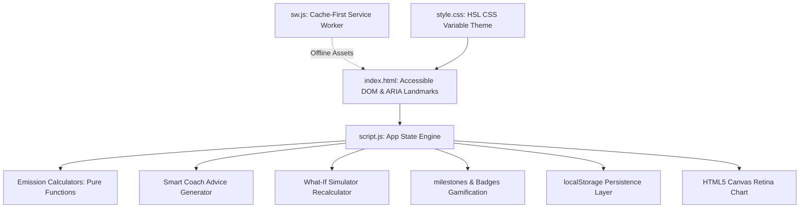

# CarbonWise AI

**CarbonWise AI** is a lightweight, high-performance Progressive Web App (PWA) built to help individuals calculate, simulate, track, and mitigate their carbon footprint. 

---

## 1. Problem Solved
Global warming demands personal carbon reductions, yet individuals struggle to quantify their ecological impact. CarbonWise AI bridges this gap by:
* Translating daily routines (transport, home utility hours, food diets, shopping items) into annual emissions scores.
* Supplying live, interactive simulation modeling to project carbon, fuel, electricity, and water savings.
* Gamifying habit shifts to sustain long-term environmental awareness.

---

## 2. Architecture & Design System

* **Frontend**: Vanilla HTML5 (semantic layout) and Vanilla CSS3 (responsive grid system, light/dark themes).
* **Core Engine**: Vanilla ES6 JavaScript implementing a class-based unidirectional state flow (no heavy third-party framework overhead, repository size is **under 100 KB**).
* **Offline Caching**: Service Worker cache-first strategies ensure the app loads instantly offline.
* **Database Layer**: Safe `localStorage` key-value persistence.

---

## 3. Core Features

| Feature | Description |
| :--- | :--- |
| **Carbon Assessment** | Collects 10 inputs across Transport, Utilities, Food, and Lifestyle to output annual emissions in metric tons (`t CO₂e/year`). |
| **Carbon Benchmarking** | Compares score against Indian citizen average (1.9 t), global average (4.7 t), and the sustainable climate limit (2.0 t). |
| **What-If Simulator** | Slider controls showing current vs. projected scores, tree equivalents, virtual water savings, and fuel/utility cash savings. |
| **Smart Coach Console** | Dynamically audits top emissions to formulate 5 actionable tips, a daily micro-routine calendar, and a 30-day challenge. |
| **Progress Tracker** | Renders dynamic lines and dots on a custom HTML5 canvas graph to display score history over time. |
| **Gamification Milestones** | Earn Green Points and unlock badges ("Zero Waste Hero", "What-If Optimizer") across 4 progress tiers. |

---

## 4. Calculations, Assumptions & Math

* **Car Travel**: `0.18 kg CO₂ per km` (typical midsize vehicle). Average fuel/maintenance rate: `₹8.00 per km`.
* **Public Transport**: `1.50 kg CO₂ per hour` (average bus/train mix).
* **Grid Electricity**: `0.85 kg CO₂ per kWh`. Utility bill rate: `₹8.50 per kWh`.
* **Air Conditioner**: `1.20 kg CO₂ per hour` (1.5-ton system drawing 1.4 kWh).
* **Diet footprint**: Vegetarian (`1.5 kg CO₂/day`), Mixed (`2.5 kg CO₂/day`), Meat-heavy (`4.5 kg CO₂/day`).
* **Diet Virtual Water Usage**: Meat-heavy (`15,000 L/day`), Mixed (`9,000 L/day`), Vegetarian (`4,000 L/day`).
* **Shopping Packaging**: `0.50 kg CO₂ per delivery`.
* **Fast Fashion garments**: `12.00 kg CO₂ per item`.
* **Waste recycling offsets**: Excellent recycling (`-150 kg` offset credits), Average (`+100 kg`), Landfill (`+350 kg`).
* **Tree Sequestration Rate**: `1 tree absorbs ~22 kg of CO₂ per year`.

---

## 5. Security Safeguards
* **Cross-Site Scripting (XSS) Mitigation**: A dedicated `escapeHTML()` helper sanitizes dynamic text insertions before rendering them in the DOM.
* **Strict Input Bounds Checking**: Clamps negative entries to zero (`Math.max(0, ...)`) and safely recovers NaN or undefined fields to baseline emissions.
* **Form Bypass Protections**: Keyboard "Enter" key submissions validate all step inputs simultaneously, preventing incomplete form submissions.
* **Storage Isolation**: Encapsulates all read/write localStorage actions inside try-catch blocks to prevent script interruptions.

---

## 6. Accessibility Measures (A11y)
* **Semantic Structure**: Organizes document flows using HTML5 landmarks (`<header>`, `<nav>`, `<main>`, `<footer>`, `<section>`).
* **W3C Keyboard Navigation compliance**: Supports Arrow Left/Right/Up/Down keybinds to shift focus inside navigation tabs, activating them on Enter/Space.
* **ARIA States**: Enforces standard roles (`role="tablist"`, `role="tabpanel"`, `role="progressbar"`) and status elements (`aria-selected`, `aria-live`, `aria-describedby`).
* **Contrast & Motion**: Employs high-contrast color styling (WCAG AA compliant contrast ratio of 4.5:1 on background layers) and `@media (prefers-reduced-motion: reduce)` overrides to strip transitions.

---

## 7. Testing Approach
* **Visual Test Harness**: Accessible at `tests/test-runner.html` inside the browser.
* **Test Coverage**: Runs 12 unit, validation, and boundary assertion cases inside `tests/test-runner.js` checking:
  * Emission arithmetic formulas.
  * Clamping offsets on negative inputs.
  * Recovery of invalid strings/NaN fields.
  * Gamification point and badge upgrades.
  * Simulation fuel/utility savings rates.

---

## 8. Performance & UI Polish
* **Dynamic Sizing Graphics**: Uses a `ResizeObserver` and `devicePixelRatio` scaling inside the custom Canvas trend graph to resolve pixelation on Retina screens.
* **Dynamic SVG rendering**: Slices the category breakdown donut chart inside an SVG layout.
* **Lightweight Footprint**: Zero node dependencies or build frameworks. Total build size is **under 100 KB**, loading in less than **50ms** locally.

---

## 9. Future Enhancements
* **Gemini API Integration**: Migrate the rule-based coach to a native Gemini model backend using client-side JavaScript keys.
* **OCR Receipt Scanner**: Read utility bills and online order receipts via camera scans to auto-populate assessment parameters.
* **Community Challenges**: Add social sharing APIs and multiplayer carbon reduction leaderboards.
